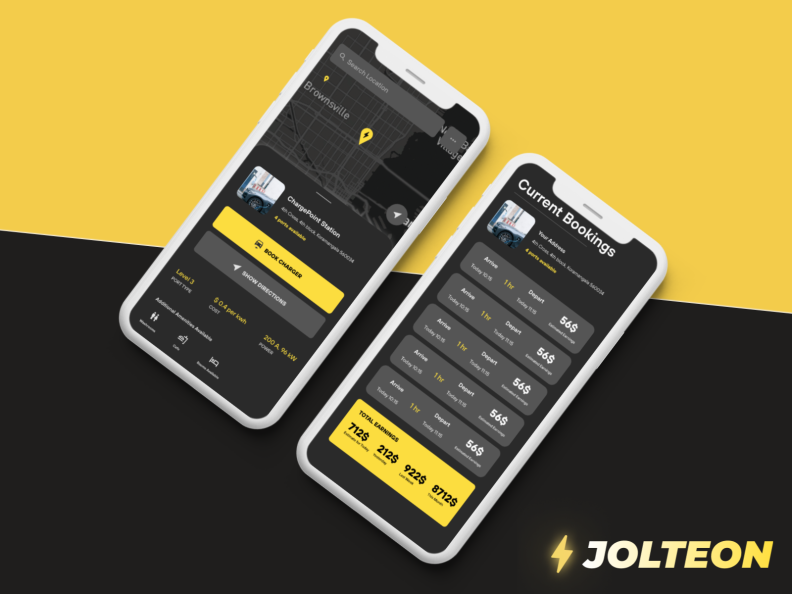
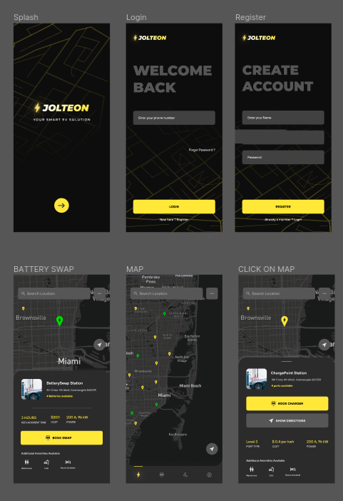
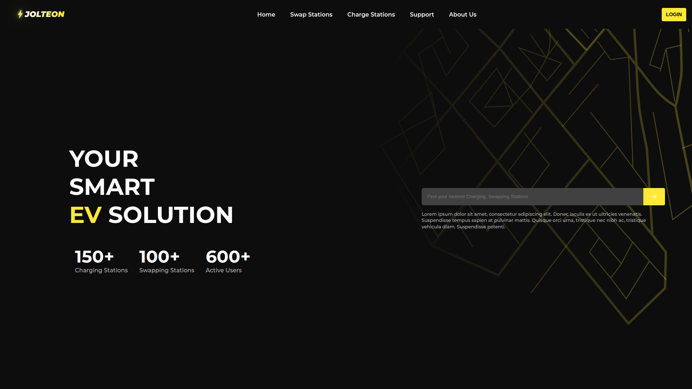

# **Jolteon** - by **U4ia**

  

#### We're building **_Jolteon - WORLD'S FIRST EV CHARGING MARKETPLACE._**

## OUR IDEA

Made using NativeBase, Jolteon is a platform to connect EV drivers with indivisuals and companies hosting EV charging stations with a subscribtion based model. We strive to make it simple to locate an `Electric Vehicle Charging Station` near you! Drivers with charing stations at home can host their garages as charging spots for a passive revenue stream! (as we call them Jolt Stations).

We aim to launch in India seeing the upcoming EV revolution and the opportunities provided by the govt and others to build, grow and monetize the EV market with the Jolteon platform.

## Sneak peek of our application

  

  

  

## TECH STACK USED

### FRONTEND

- Figma
- React Native
- Expo
- Nativebase UI Components

### BACKEND

- Firebase (Firestore and Authentication)

## OUR TEAM

1. [Kathan Desai](https://github.com/kathan3009)
2. [Dhruva Goyal](https://github.com/shero4)
3. [Aditya Mohan](https://github.com/adityamhn)
4. [Sitaraman S](https://github.com/hackerbone)

## LINKS

- [Download the apk]()
- [Figma Design](https://www.figma.com/file/3vqut6JSJWry88cwuLUHPi/Jolteon?node-id=2%3A24)
- [Product Video](https://youtu.be/h3LfmKAh3VY)
<!-- - [Product Demo]() -->
